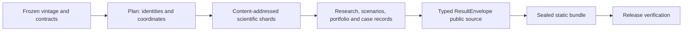

# V2 dependency boundaries

The V2 roots are deliberately directional. `application` is the orchestration
layer and may call domain stages, execution, provenance, publishing, research,
scenarios, and schemas. Domain roots do not import `application` or `cli`.

| Layer | Direct internal dependencies |
| --- | --- |
| `schemas` | `provenance` identity serialization only |
| `provenance` | none |
| `execution` | `provenance` |
| `scenarios` | `contracts`, `models`, `provenance`, `schemas` |
| `portfolio` | none outside its own root |
| `publishing` | `provenance`, `schemas` |
| `research` | `contracts`, `portfolio`, `provenance`, `publishing`, `schemas` |
| `application` | declared domain roots plus `execution` and `provenance` |

`tests/unit/test_imports.py` enforces these roots and the retained V1 package
rules by AST. Adding a dependency requires documenting the boundary here and a
specific allowlist entry; neither a wildcard nor a domain-to-application import
is permitted.

The retained `hedge` domain also imports `provenance` for V2 decision identity;
it remains a domain-to-foundation dependency and is covered by the same check.

## Artifact flow

`ScenarioSet` and `ScenarioMatrix` carry the shared coordinate boundary from
scientific artifacts through portfolio calculations and public projections.
`ResultEnvelope` adds release, source, model, vintage, scenario and status
identity at the public boundary. The browser consumes only verified envelopes;
it never reconstructs a research result from a raw source panel. A release
bundle is a descendant of a frozen public source and its lock, rather than a
second scientific producer.
